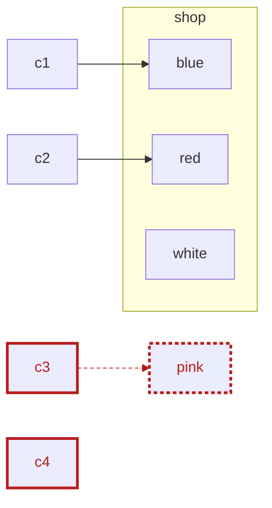
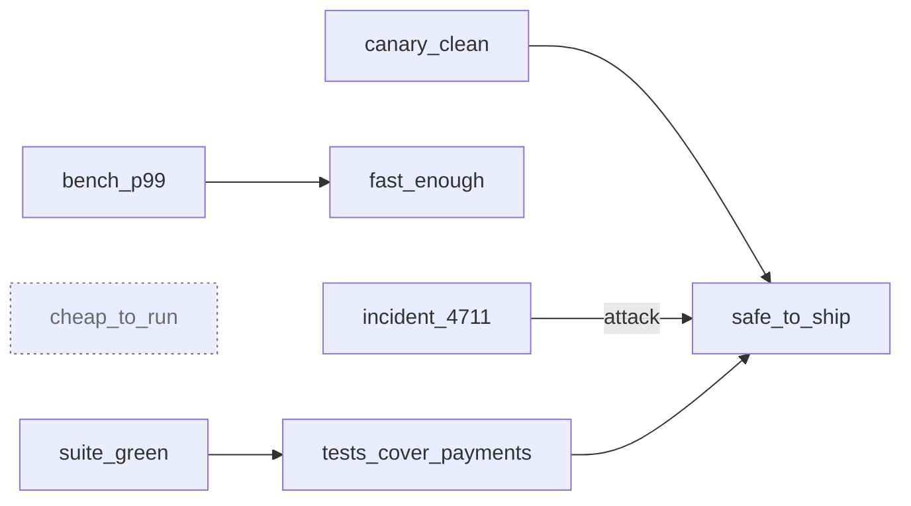
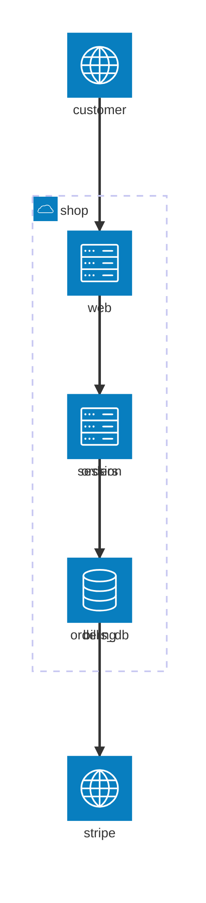
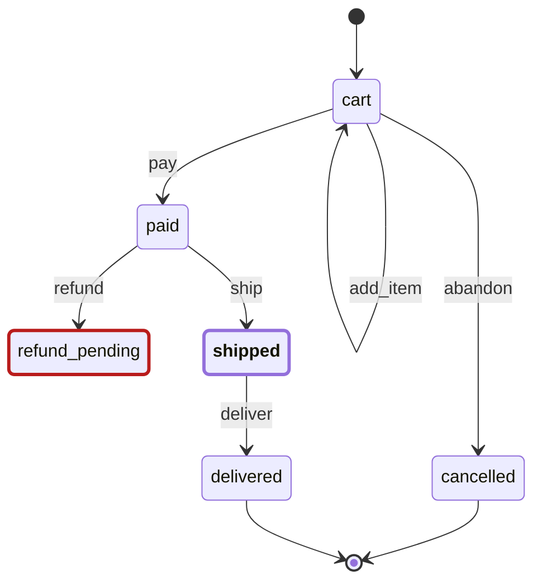
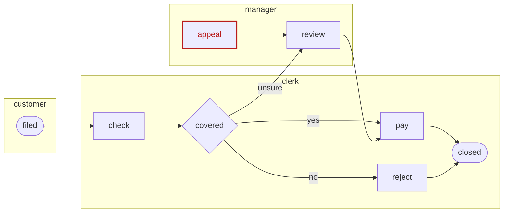
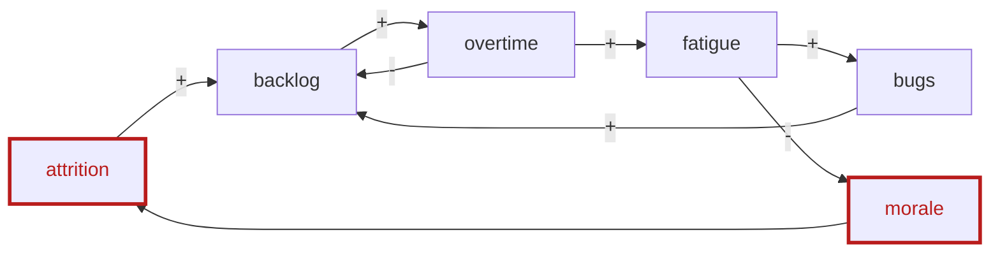
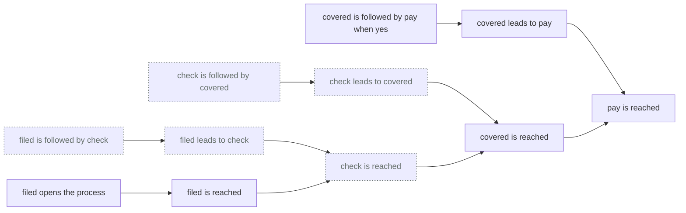

# Drawing

A `draw K` line in a cell draws what the notebook concluded as a picture of
kind `K`. The picture is made of facts, so it can be checked like any
others. A `never` over it is an invariant, `why` on a mark is a proof, and
`excise` before a `draw` shows what one fact changes.

Every picture on this page is generated by `npm run guide` from the example
it names, and `npm run guide -- --check` fails when one is stale. Where the
VS Code renderer draws SVG, the page shows that SVG. The graph kinds need a
browser to lay them out, so the page shows their mermaid instead, which
GitHub draws.

## How a notebook draws

1. **Read a view vocabulary.** It lists the words a picture is made of:
   `visual/graph.rofl.md` (a mark, a link, a group), `visual/time.rofl.md`
   (a lane, an interval, a message), `visual/table.rofl.md` (a row, a
   column, a value), `visual/space.rofl.md` (a point, a box, an axis) and
   `visual/notation.rofl.md` (a person, a birth, a family). They ship with
   ROFL, so a notebook names one without a path:
   `reads: [rofl:visual/graph.rofl.md]`.
2. **Say, in rules, what is a mark.** For example, "a car X is a node if X
   is on the line", or "X links to Y if X is to be painted Y". These rules
   are the adapter from your domain to the picture.
3. **Ask for it.** `draw graph`, `draw time`, `draw table`, `draw space` and
   `draw notation` draw the five families. Each dialect and form below has a
   name of its own.

In VS Code the picture draws under the cell. On the command line,
`rofl-nb F.rofl.md` prints its counts and its text: mermaid, DOT, Argdown,
Vega-Lite, GeoJSON, a Markdown table or GEDCOM. Add `--format F` to choose
one of these, and `--json` to get the view with its provenance.

## What every picture carries

- **Status.** The renderer tags a mark itself; these tags are reserved, and
  an adapter cannot write them:
  - `failing`: a `never` in the notebook names it.
  - `dangling`: a link points at no mark.
  - `unknown`: the inquiry rules say nobody knows it.
  - `blind`: it comes from a file the model could not read.
  - `gone` and `new`: an `excise` in the cell removed or added it.
- **Why.** Click a mark in VS Code: the facts it rests on are said in
  sentences, one proof step down.
- **What-if.** `excise F` and then `draw K` in one cell draws the picture
  after the retraction. What the retraction took away is tagged `gone`, and
  what it let through is tagged `new`.
- **Frames.** `frame(M, F)` puts a mark in frame `F`. The picture becomes
  small multiples, one per frame in order, and each frame is compared with
  the one before it.
- **Zoom.** `collapsed(G)` shuts a group into one mark labelled with how
  many marks it holds, and a click opens it again. What a group is depends
  on the kind:
  - a graph: what is `inside` it;
  - a timeline: the lanes in a `lane_group`;
  - a proof: the facts under a fact.
- **Pin layout.** In VS Code, a graph's picture can be pinned:
  `placed(M, X, Y)` facts are written beside the notebook, and a notebook
  that reads them draws each mark there.

## Graph

A mark and the links between marks, laid out by ELK in VS Code. Each
dialect is the graph's vocabulary plus tags the dialect gives a meaning and
a look.

### graph

[`paint-shop.rofl.md`](../examples/visual/paint-shop.rofl.md): the cars on
the line, an arrow to the colour each is to be painted. The cars that leave
unpainted fail a `never`; `c3`'s arrow points at a colour the shop does not
have, so it dangles.

<!-- BEGIN draw examples/visual: paint-shop.rofl.md -->

<!-- END draw -->

### argument

[`deploy-argument.rofl.md`](../examples/visual/deploy-argument.rofl.md): a
claim, the evidence for and against it, each claim with its grade. `draw
argument` writes Argdown; the same view draws as a graph.

<!-- BEGIN draw examples/visual: deploy-argument.rofl.md -->
```argdown
[cheap_to_run] #unknown

[fast_enough] #supported
  + <bench_p99>

[safe_to_ship] #contested
  + <canary_clean>
  - <incident_4711>
  + [tests_cover_payments] #supported
    + <suite_green>
```


<!-- END draw -->

### architecture

[`shop-architecture.rofl.md`](../examples/visual/shop-architecture.rofl.md):
containers in their system's boundary and in their layers, drawn top down.
A call from a service up into the web layer fails the `never`.

<!-- BEGIN draw examples/visual: shop-architecture.rofl.md -->

<!-- END draw -->

### state

[`order-states.rofl.md`](../examples/visual/order-states.rofl.md): states
and the events between them, with an entry dot, a final ring and the
current state highlighted. A state with a way in and no way out is stuck.

<!-- BEGIN draw examples/visual: order-states.rofl.md -->

<!-- END draw -->

### process

[`claim-process.rofl.md`](../examples/visual/claim-process.rofl.md): steps
in the lane of whoever does them, a gateway where the flow branches. A step
nothing flows into is unreachable.

<!-- BEGIN draw examples/visual: claim-process.rofl.md -->

<!-- END draw -->

### causal

[`burnout-loop.rofl.md`](../examples/visual/burnout-loop.rofl.md):
quantities and the signed influences between them, laid on a ring so the
loops show. An influence nobody measured has no sign.

<!-- BEGIN draw examples/visual: burnout-loop.rofl.md -->

<!-- END draw -->

### proof

[`claim-proof.rofl.md`](../examples/visual/claim-proof.rofl.md): the proof
of each `why` in the cell as a tree. Each fact sits above the facts it
rests on, down to the facts nobody concluded. A fact about a term nobody
knows is drawn `unknown`. Shutting a fact folds its subproof into it. VS
Code draws the tree upward; here it is the graph's mermaid, and on the
command line the indented text `why` prints.

<!-- BEGIN draw examples/visual: claim-proof.rofl.md -->

<!-- END draw -->

## Time

Lanes and what happens in them, on one axis of time.

### time: a Gantt chart

[`spat-thursday.rofl.md`](../examples/visual/spat-thursday.rofl.md): a lane
per person, a bar per thing they do, and a red bar wherever a child is
alone while awake.

<!-- BEGIN draw examples/visual: spat-thursday.rofl.md -->

<!-- END draw -->

### time: a sequence

[`checkout-sequence.rofl.md`](../examples/visual/checkout-sequence.rofl.md):
marks that go from lane to lane draw as messages. A call that is never
answered fails the `never`.

<!-- BEGIN draw examples/visual: checkout-sequence.rofl.md -->

<!-- END draw -->

### timeline

[`outage-timeline.rofl.md`](../examples/visual/outage-timeline.rofl.md):
what happened at a point, in order, on one axis. An alert that came late is
red.

<!-- BEGIN draw examples/visual: outage-timeline.rofl.md -->

<!-- END draw -->

### timing

[`breaker-timing.rofl.md`](../examples/visual/breaker-timing.rofl.md): a
signal per lane stepping between its states. A breaker open too long is
red.

<!-- BEGIN draw examples/visual: breaker-timing.rofl.md -->

<!-- END draw -->

## Table

Rows by columns by values.

### table

[`coverage.rofl.md`](../examples/visual/coverage.rofl.md): a coverage
matrix as a Markdown table. The rows the audits name are marked.

<!-- BEGIN draw examples/visual: coverage.rofl.md -->
| | l_x | l_y |
|---|---|---|
| k_a [failing] | done | open [failing] |
| k_b | claimed | waived |
| k_c [failing] | open [failing] | done |
<!-- END draw -->

### chart

[`suite-chart.rofl.md`](../examples/visual/suite-chart.rofl.md): the mark
`draws` names, on the channels `shows` names. A suite over its budget is
red.

<!-- BEGIN draw examples/visual: suite-chart.rofl.md -->

<!-- END draw -->

### heatmap

[`coverage-heatmap.rofl.md`](../examples/visual/coverage-heatmap.rofl.md):
a cell coloured by its value. An open cell no work item claims is outlined
red.

<!-- BEGIN draw examples/visual: coverage-heatmap.rofl.md -->

<!-- END draw -->

### upset

[`access-upset.rofl.md`](../examples/visual/access-upset.rofl.md): with
more sets than circles can hold, a bar per set and a column per
intersection. A person in two duties at once is marked.

<!-- BEGIN draw examples/visual: access-upset.rofl.md -->

<!-- END draw -->

### euler

[`oncall-euler.rofl.md`](../examples/visual/oncall-euler.rofl.md): three
sets or fewer as circles, and each person in the region of exactly their
sets.

<!-- BEGIN draw examples/visual: oncall-euler.rofl.md -->

<!-- END draw -->

### decision

[`shipping-decision.rofl.md`](../examples/visual/shipping-decision.rofl.md):
in VS Code a rule per column, its conditions above its actions; here, its
Markdown table, a rule per row. A gap and an overlap are both failures.

<!-- BEGIN draw examples/visual: shipping-decision.rofl.md -->
| | big_order | discount | free_shipping | member |
|---|---|---|---|---|
| $gap(no,no) [gap, failing] | no |  |  | no |
| r1 [overlaps, failing] | any |  | x | yes |
| r2 | yes |  | x | no |
| r3 [overlaps, failing] | yes | x |  | yes |
<!-- END draw -->

## Space

The data is the geometry, so nothing is laid out.

### space: a map

[`rail-map.rofl.md`](../examples/visual/rail-map.rofl.md): stations at their
longitude and latitude. A station no line reaches is red where it stands.
On the command line the map is GeoJSON.

<!-- BEGIN draw examples/visual: rail-map.rofl.md -->

<!-- END draw -->

### space: a plan

[`office-plan.rofl.md`](../examples/visual/office-plan.rofl.md): rooms as
boxes and desks as points. A desk in no room is red.

<!-- BEGIN draw examples/visual: office-plan.rofl.md -->

<!-- END draw -->

### space: axes

[`wardley.rofl.md`](../examples/visual/wardley.rofl.md): components placed
by how evolved and how visible they are. A component that depends on a
more visible one breaks the chain's order.

<!-- BEGIN draw examples/visual: wardley.rofl.md -->

<!-- END draw -->

## Notation

When a domain has its own tool and standard, the notebook writes the file
that tool reads and leaves the drawing to it.
[`family-tree.rofl.md`](../examples/visual/family-tree.rofl.md) writes
GEDCOM 7, and in VS Code *Open* puts it beside the notebook.

<!-- BEGIN draw examples/visual: family-tree.rofl.md -->
```gedcom
0 HEAD
1 GEDC
2 VERS 7.0
1 NOTE drawn from a ROFL notebook by `draw notation`
0 @I1@ INDI
1 NAME Anna /Petrova/
1 BIRT
2 DATE 1950
1 FAMS @F1@
1 FAMC @F2@
0 @I2@ INDI
1 NAME Boris /Sokolov/
1 BIRT
2 DATE 1948
1 FAMS @F1@
0 @I3@ INDI
1 NAME Ivan /Petrov/
1 BIRT
2 DATE 1921
1 FAMS @F2@
0 @I4@ INDI
1 NAME Lena /Sokolova/
1 BIRT
2 DATE 1946
1 FAMC @F1@
0 @I5@ INDI
1 NAME Olga /Petrova/
1 BIRT
2 DATE 1925
1 FAMS @F2@
0 @F1@ FAM
1 HUSB @I1@
1 WIFE @I2@
1 CHIL @I4@
0 @F2@ FAM
1 HUSB @I3@
1 WIFE @I5@
1 CHIL @I1@
0 TRLR
```
<!-- END draw -->

## The coverage of this page, drawn by itself

[`visual/vscode-coverage.rofl.md`](../visual/vscode-coverage.rofl.md) is the
matrix that tracks how each kind above is covered in VS Code. Its rows are
the kinds and its columns what "covered" means. Each cell is `done` with
evidence, `waived` with a reason, `claimed` by open work, or `open`. It
draws itself as a heatmap.

<!-- BEGIN draw visual: vscode-coverage.rofl.md -->

<!-- END draw -->
